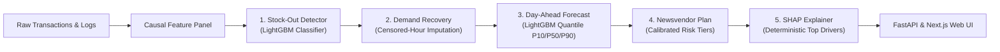

# CashReady: AI Liquidity Planner for MFS Agents

> **AI DEV FEST 2026 — Track 05 (DIU CPC × upay):** Automated Liquidity Management for Mobile Financial Services Agents.

CashReady solves the unobserved demand dilemma in mobile money: when agents run out of cash or electronic float, frustrated customers turn away without a digital record. CashReady detects hidden stock-outs from transaction rhythms, reconstructs unserved demand, generates day-ahead quantile forecasts (P10, P50, P90), and optimizes calibrated morning opening balances with deterministic SHAP explanations.

---

## Live Deployments & Documentation

| Service | Target | URL |
|---|---|---|
| **Web Dashboard** | Next.js 14 Responsive UI (Bilingual) | [http://204.136.10.31:8200/agent](http://204.136.10.31:8200/agent) |
| **Interactive API Docs** | FastAPI Swagger UI | [http://204.136.10.31:8100/docs](http://204.136.10.31:8100/docs) |
| **API Reference** | ReDoc OpenAPI Documentation | [http://204.136.10.31:8100/redoc](http://204.136.10.31:8100/redoc) |
| **OpenAPI Schema** | Raw JSON Specification | [http://204.136.10.31:8100/openapi.json](http://204.136.10.31:8100/openapi.json) |

---

## The Core Challenge: "Data Lies"

In traditional time-series forecasting, models train exclusively on observed transaction logs. During stock-outs, demand drops to zero in the database, falsely signaling low customer interest. Naive models repeat this cycle, leaving agents chronically underfunded during peak periods (e.g., salary disbursements, weekly Haat days, and Eid festivals).

```
   Actual Walk-in Demand:  ████████████████████ (High Peak)
   Logged Transactions:    ██████░░░░░░░░░░░░░░ (Drops to 0 due to Stockout)
                                 ▲
                                 └── CashReady reconstructs this lost demand!
```

> [!IMPORTANT]
> **Deterministic Math Over Generative Hallucinations:**
> All liquidity recommendations, quantile intervals, and SHAP feature attributions are calculated using algorithmic newsvendor models and TreeExplainer mathematics. Generative LLMs are never permitted to generate or hallucinate financial quantities.

---

## Architecture & Machine Learning Pipeline

CashReady implements a 5-stage causal pipeline strictly utilizing data available prior to the forecast day:



1. **Stock-Out Detector:** Identifies true cash stock-outs, float stock-outs, and closures without requiring hardware sensors ($F_1 = 0.7852$, a $+96\%$ improvement over heuristics).
2. **Censored Demand Recovery:** Reconstructs true walk-in demand using clean-hour regression gated at $P(\text{stockout}) \ge 0.5$ with digital payment substitution guard.
3. **Day-Ahead Quantile Forecasting:** Predicts P10, P50, and P90 cash needs using strictly causal lag features (lag 1d, lag 7d, rolling 7d/28d averages, and haat/calendar indicators).
4. **Calibrated Morning Cash Allocation:** Applies continuous newsvendor optimization balancing lost commission cost against overnight capital holding costs across 3 risk tiers (80% Higher Risk, 90% Balanced, 95% Safest).
5. **Deterministic SHAP Explanations:** Explains recommendations using top-3 feature attributions mapped into natural language advisory messages in both Bengali and English.

---

## Evaluation & Measured Results (30-Day Out-of-Sample Test)

Evaluated on days 60–89 across 300 agents and 12 distinct geographic areas under realistic Bangladesh retail stress conditions:

| Metric | CashReady | Baseline | Improvement / Significance |
|---|---|---|---|
| **Detector $F_1$ Score** | **0.7852** (all-hours: 0.6786) | Rule: 0.3989, HMM: 0.6553 | **+96.8%** over static heuristics |
| **Recovery MAE** | **67.76%** | Naive: 71.87%, Mean: 69.74% | **-4.11%** absolute error reduction |
| **Forecast Calibration** | **84.74%** in P10–P90 | Target: 80.00% | Well-calibrated coverage |
| **Unserved Lost Demand** | **0.48%** | Habit Policy: 18.10% | **97.3%** demand saved from stock-out |
| **Agent Commission Saved** | **1,118,330 BDT** | Habit Policy | Direct agent income enhancement |

---

## API Surface

The FastAPI backend provides typed OpenAPI 3.1 endpoints secured with constant-time API key verification:

| Endpoint | Method | Key Parameters | Description |
|---|---|---|---|
| `/health` | `GET` | — | Health check and artifact readiness probe |
| `/agents` | `GET` | `area_id` (optional) | Agent roster filtered by area |
| `/areas` | `GET` | — | Distinct geographic areas and classifications |
| `/metrics` | `GET` | — | Pipeline evaluation metrics and baseline comparisons |
| `/agents/{id}/plan` | `GET` | `date`, `risk` (`0.8`\|`0.9`\|`0.95`) | Morning cash recommendation with SHAP drivers |
| `/agents/{id}/lost-demand` | `GET` | `week` (`YYYY-Www`) | Weekly unserved customer demand and lost revenue |
| `/agents/{id}/feedback` | `POST` | `{helpful, comment}` | Agent feedback audit trail (JSONL logging) |
| `/areas/{id}/risk` | `GET` | `date` | Area-wide agent stock-out risk distributions |
| `/areas/lost-demand` | `GET` | `week` (`YYYY-Www`) | Area-level aggregated weekly unserved demand |

> [!TIP]
> Visit the interactive [Swagger Documentation](http://204.136.10.31:8100/docs) to execute queries directly against the live test API.

---

## Tech Stack & Project Structure

- **Backend:** Python 3.11, FastAPI, Uvicorn, Pydantic v2, LightGBM, SHAP, Scikit-learn, PyArrow, NumPy, Pandas.
- **Frontend:** Next.js 14 (App Router), React 18, TypeScript, Tailwind CSS, Recharts, Lucide Icons.
- **Infrastructure:** Docker, Docker Compose, NextDeploy CLI.

```
cashready/
├── api/                        # FastAPI application
│   ├── main.py                 # Route definitions & mtime-cached artifact loader
│   └── schemas/                # Modular Pydantic response models
├── artifacts/
│   ├── eval/                   # Model performance JSONs and diagnostic plots
│   └── serve/                  # Serving artifacts (agents, plans, area risk, metrics)
├── cashready/                  # Core ML pipeline modules
│   ├── config.py               # Central configuration, seeds, and retail assumptions
│   ├── simulate.py             # Realistic retail transaction & stockout simulation
│   ├── features.py             # Causal feature panel engineering
│   ├── detector.py             # LightGBM multiclass stock-out classification
│   ├── recovery.py             # Censored demand estimation
│   ├── forecast.py             # Day-ahead quantile regression
│   ├── business_sim.py         # Newsvendor optimization and policy simulation
│   ├── explain.py              # SHAP TreeExplainer & advisory generation
│   └── export.py               # Serving artifact compiler
├── tests/                      # Automated test suite (Pytest & TestClient)
├── web/                        # Next.js 14 frontend web application
│   ├── app/                    # App Router pages (/agent, /area, /evidence)
│   ├── components/             # Reusable UI components & navigation
│   └── lib/                    # API client, types, mock fallbacks, and i18n
├── docker-compose.yml          # Production multi-container orchestration
├── Dockerfile                  # Slim production API container image
└── Makefile                    # Developer workflow automation
```

---

## Quickstart & Local Setup

### Option 1: Docker Compose (Production Setup)

```bash
# Clone the repository
git clone https://github.com/masudranaxpert/cashready.git
cd cashready

# Launch API (:8100) and Web UI (:8200) containers
docker compose up --build -d
```

### Option 2: Local Python & Node.js Development

```bash
# 1. Setup Python virtual environment
python3 -m venv .venv
source .venv/bin/activate
pip install -r requirements.txt

# 2. Run simulation and ML pipeline
make data && make pipeline

# 3. Start Backend API server (runs on :8100)
PORT=8100 make api

# 4. Start Frontend development server (in a separate terminal)
cd web
npm install
NEXT_PUBLIC_API_URL=http://localhost:8100 npm run dev
```

---

## Verification & Testing

The repository maintains automated test suites across both backend and frontend layers:

```bash
# Run backend test suite (8/8 tests passing, including security input validation)
make test

# Run frontend contract & verification tests (11/11 tests passing)
npm --prefix web test

# Run frontend TypeScript type checking (0 errors)
npm --prefix web run typecheck
```

---

## Synthetic Data & Ethical AI Constraints

1. **Privacy Preservation:** Due to strict customer privacy regulations governing Bangladesh MFS records, all experimental datasets are generated via `cashready/simulate.py` using empirical parameters derived from retail studies (salary dates, weekly remittances, Haat days, Eid surges, and neighbor rerouting).
2. **Demographic Equity:** Liquidity buffers and service levels are validated across urban, peri-urban, and rural areas to prevent systemic under-allocation to remote or lower-volume agents.
3. **Decoupled Advisory:** Recommendations are produced via reproducible mathematical optimization; language strings are generated from deterministic rules rather than black-box text generators.

---

## Core Team

- **Masud Rana** — ML Pipeline, Statistical Modeling & Architecture Lead
- **Ajmine Adil** — Frontend Architecture, UI/UX Engineering & Integration Lead
- **Farhana Nasrin** — Backend Engineering, Testing & Deployment Lead
