# Production architecture

CashReady runs a daily pipeline from core banking logs through feature engineering, model scoring, artifact release, and low-latency API serving for morning agent dispatch.

## Production data pipeline

```mermaid
flowchart TD
    subgraph DataWarehouse["1. upay Core Banking & Data Warehouse"]
        RAW_TXN["Raw Transaction Logs\n(Cash-Out, Cash-In, Send-Money, Bill-Pay)"]
        CORE_LEDGER["Agent Ledger & Float Balances"]
    end

    subgraph Ingestion["2. Secure Anonymised Ingestion (01:00 UTC)"]
        DE_ID["Pseudonymization & PII Stripping\n(Salted SHA-256 for Agent/Customer IDs)"]
        VAL_GATE["Schema Validation & Completeness Checks"]
    end

    subgraph FeatureStore["3. Nightly Feature Pipeline (02:00 UTC)"]
        HOURLY_AGG["Hourly Aggregator\n(tx_count, volume, velocity, zero-run lengths)"]
        NEIGHBOR["Spatial & Cluster Context Engine\n(Same-area neighbour pressure & spillover)"]
        CALENDAR["Calendar & Shock Encoding\n(Salary cycle, weekly haat days, festival lead)"]
        FEAT_PANEL["Master Agent-Hour Panel"]
    end

    subgraph MLPipeline["4. ML Inference & Optimization Pipeline (03:30 UTC)"]
        DETECTOR["1. Stock-Out Detector (LightGBM)\n(Normal, Cash-Depleted, Float-Depleted, Closed)"]
        RECOVERY["2. Censored Demand Recovery Engine\n(Unobserved walk-in demand reconstruction)"]
        FORECASTER["3. Day-Ahead Quantile Forecaster\n(Pinball loss P10, P50, P90 hourly demand)"]
        PLANNER["4. Newsvendor Liquidity Optimizer\n(Running maximum net cash/float need at 80%, 90%, 95%)"]
        SHAP_EXP["5. Deterministic SHAP Explainer\n(Top-3 feature drivers in Bengali & English)"]
    end

    subgraph ReleaseMgmt["5. Release Packaging & Verification (05:00 UTC)"]
        INTEG_TEST["Automated Contract & Metric Sanity Tests"]
        RELEASE_DIR["Versioned Release\n(artifacts/releases/vYYYY.MM.DD/)"]
        SYMLINK["Atomic Pointer Switch\n(artifacts/serve -> active release)"]
    end

    subgraph Serving["6. Edge Serving API & Distribution (06:00 - 07:00 UTC)"]
        FASTAPI["FastAPI High-Throughput Service\n(In-memory caching, auth guard, RBAC)"]
        SMS_JOB["Nightly SMS Dispatcher (07:00 BDT)\n(Concise Bangla SMS <= 160 chars)"]
        WEB_APP["Next.js Responsive Web App\n(Mobile PWA for Agents & Area Managers)"]
    end

    subgraph Consumption["7. Operational Consumption"]
        AGENT_USER["MFS Agent\n(Receives 07:00 SMS / Views Plan & SHAP Drivers)"]
        MGR_USER["Area Territory Manager\n(Monitors Cluster Risk & Unserved Demand)"]
    end

    subgraph ClosedLoop["8. Closed-Loop Feedback & Retraining"]
        FEEDBACK["Agent Feedback Loop\n(POST /feedback: Helpful? Stocked out?)"]
        DRIFT_MON["Drift & Performance Monitor\n(PSI, KS-Test, F1 Drop, Discrepancy)"]
        RETRAIN_TRIGGER{"Retraining Trigger\n(Scheduled / Drift Alert)"}
    end

    RAW_TXN --> DE_ID
    CORE_LEDGER --> DE_ID
    DE_ID --> VAL_GATE
    VAL_GATE --> HOURLY_AGG
    HOURLY_AGG --> NEIGHBOR
    HOURLY_AGG --> CALENDAR
    NEIGHBOR --> FEAT_PANEL
    CALENDAR --> FEAT_PANEL
    FEAT_PANEL --> DETECTOR
    DETECTOR --> RECOVERY
    RECOVERY --> FORECASTER
    FORECASTER --> PLANNER
    PLANNER --> SHAP_EXP
    SHAP_EXP --> INTEG_TEST
    INTEG_TEST --> RELEASE_DIR
    RELEASE_DIR --> SYMLINK
    SYMLINK --> FASTAPI
    FASTAPI --> SMS_JOB
    FASTAPI --> WEB_APP
    SMS_JOB --> AGENT_USER
    WEB_APP --> AGENT_USER
    WEB_APP --> MGR_USER
    AGENT_USER --> FEEDBACK
    FEEDBACK --> DRIFT_MON
    RAW_TXN -.-> DRIFT_MON
    DRIFT_MON --> RETRAIN_TRIGGER
    RETRAIN_TRIGGER -- "Yes" --> DETECTOR
```



## Ingestion and privacy standards

- Zero PII policy: Customer phone numbers, National Identity (NID) numbers, and wallet addresses are stripped at the ingestion gateway before entering the pipeline.
- Agent pseudonymization: Agent wallet IDs are replaced with deterministic salted hashes (`T0001` format) allowing temporal tracking without storing personal identities.
- Data quality guards: Ingestion verifies that all 14 operating hours (08:00 to 22:00) exist per active agent, catching system outage days or corrupted ledger syncs before downstream execution.

## Retraining triggers and cadence

| Trigger Type | Condition | Action |
|---|---|---|
| Scheduled Cadence | Every Sunday at 02:00 UTC (Weekly) | Retrain LightGBM detector and forecast quantiles with rolling 60-day window. |
| Calendar Shock Event | 7 days prior to national festivals (Eid-ul-Fitr, Eid-ul-Adha, Durga Puja) | Warm-start models with previous year festival priors and update calendar multiplier flags. |
| Statistical Drift Trigger | Population Stability Index (PSI) $> 0.25$ on key volume features | Automated alert to MLOps, trigger shadow retraining on recent 30-day panel. |
| Feedback Discrepancy | Reported stockout rate diverges from predicted stockout rate by $> 15\%$ over 7 days | Initiate pipeline audit and threshold recalibration. |
| Detector F1 Degradation | Validation Macro $F_1$ drops below $0.70$ during nightly evaluation | Halt automated release deployment; alert engineering team. |

## Drift thresholds and monitoring

Monitoring runs continuously against rolling 7-day and 30-day validation windows:

- Feature distribution drift (PSI):
  - $\text{PSI} < 0.10$: Stable; no action.
  - $0.10 \le \text{PSI} \le 0.25$: Moderate drift; warning logged in monitoring dashboard.
  - $\text{PSI} > 0.25$: Significant feature distribution shift; triggers automated model refit.
- Statistical distance (two-sample Kolmogorov-Smirnov test):
  - Evaluated on hourly transaction amounts and arrival counts per area type ($p < 0.01$ indicates significant shift).
- Residual and pinball loss monitoring:
  - P50 Mean Absolute Error (MAE) evaluated on normal non-depleted hours. If MAE exceeds $3,500\text{ BDT}$ (baseline naive is $3,006\text{ BDT}$), fallback to rolling-7d median is enabled.

## Rollback procedure

CashReady enforces zero-downtime, instantaneous rollback via immutable versioned releases:

1. Release directory structure:
   ```
   artifacts/
   ├── releases/
   │   ├── v2026.10.01/
   │   │   ├── manifest.json
   │   │   ├── agents.json
   │   │   ├── plans/
   │   │   ├── area_risk/
   │   │   └── lost_demand/
   │   └── v2026.10.02/
   └── serve -> releases/v2026.10.02/   # Atomic symlink pointer
   ```
2. Instant revert:
   If a newly deployed release exhibits corrupted schemas, stale predictions, or anomalous recommendations, the automated rollback script switches the pointer:
   ```bash
   python scripts/rollback.py v2026.10.01
   ```
3. API process safety: The FastAPI backend serves through the symlink or pointer file with in-memory TTL caching, picking up rolled-back artifacts within seconds without restarting server processes.

## Data retention policy

| Data Layer | Retention Period | Storage Tier | Encryption & Access |
|---|---|---|---|
| Raw Ingestion Logs | 90 days | Encrypted Cloud Object Storage (Hot) | KMS AES-256; restricted to Data Platform ETL service |
| Engineered Panel Parquet | 180 days | Parquet on Object Storage (Warm) | Internal pipeline access only; zero customer PII |
| Model Releases & Artifacts | 1 year | Versioned Artifact Store (Immutable) | Read-only API service account access |
| Historical Aggregates | 2 years | Analytical Data Warehouse (Cold) | Role-restricted for macro MFS trend analytics |
| Agent Feedback JSONL | 365 days | Append-only Audit Log | Accessible for model evaluation and audit trails |

## Role-based access control (RBAC)

The API and web services enforce role scoping to protect commercial operational data:

| Role | Identifying Headers | Allowed Actions | Restricted Actions |
|---|---|---|---|
| Agent | `X-Role: agent`<br>`X-Agent-Id: <agent_id>` | • View own daily liquidity plan (`/agents/{id}/plan`)<br>• Submit plan feedback (`/agents/{id}/feedback`)<br>• View own historical lost demand | Cannot access other agents' plans<br>Cannot access area-wide manager views<br>Cannot view global model metrics |
| Area Manager | `X-Role: manager`<br>`X-Area-Id: <area_id>` | • View area risk distribution (`/areas/{id}/risk`)<br>• View area lost demand & digital shift<br>• View all agents in assigned area | Cannot view agents in other territories<br>Cannot access core model training parameters |
| Executive / Admin | `X-Role: manager`<br>`X-Area-Id: all` | • View global pipeline metrics (`/metrics`)<br>• Access all area risk summaries<br>• Inspect model evidence and evaluation | None |

In production mode (`ENV=production`), an `X-API-Key` is mandatory for all non-health requests. The Next.js BFF (Backend-for-Frontend) server-side proxy attaches the credential so secrets are not exposed to browser sessions.
